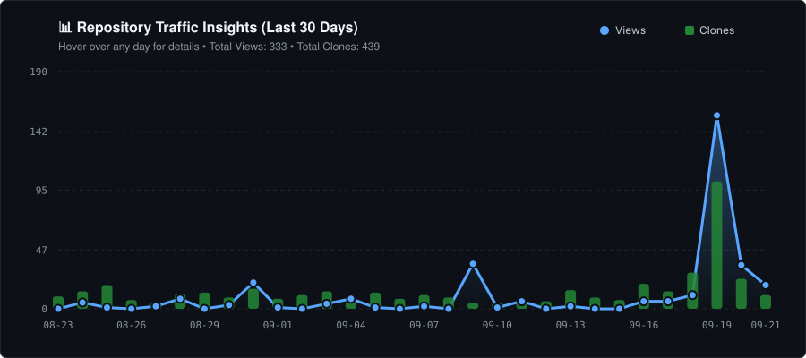

# 📰 The Dev Summary
### Daily Tech News for Developers & Engineers. Minimal Noise, Maximum Insight.

**[Live Site](https://sivasubramoniam-js.github.io/the-dev-summary/)**

### 🌍 Global Multi-language Support
The Dev Summary automatically adapts to your preferred language, ensuring tech news is accessible to everyone.

| English | Spanish | French |
| :---: | :---: | :---: |
|  |  |  |

| Hindi | Tamil | Telugu | Chinese |
| :---: | :---: | :---: | :---: |
|  |  |  |  |

---

## 🚀 What is The Dev Summary?

**The Dev Summary** is a specialized daily editorial platform designed for software engineers, architects, and tech enthusiasts. In a world of information overload, we focus on providing a high-signal, low-noise summary of the most critical tech stories of the day.

Every morning, our engine curates the top headlines from across the industry—from open-source breakthroughs to cloud architecture updates—and presents them in a clean, professional, and distraction-free interface.

---

## ✨ Key Features

- **Daily Editorial Dispatches**: Fresh news delivered daily.
- **Curated High-Signal Content**: We filter through the noise to bring you stories that actually matter to developers.
- **Premium Editorial Design**: A typography-first interface designed for reading, inspired by world-class news journals.
- **PWA Ready**: Install the app on your mobile home screen or desktop for an app-like experience.
- **Minimalist Experience**: No ads, no tracking, just news.

---

## 📱 How to Use

### On the Web
Simply visit [The Dev Summary](https://sivasubramoniam-js.github.io/the-dev-summary/) on any browser.

### Install as an App (PWA)
1. **On iPhone (Safari)**: Tap the "Share" icon and select **"Add to Home Screen"**.
2. **On Android (Chrome)**: Tap the three dots and select **"Install App"**.
3. **On Desktop (Chrome/Edge)**: Click the "Install" icon in the address bar.

---

## 📬 Stay Updated
Bookmark the site or install the PWA to make **The Dev Summary** part of your morning routine.

---

## ☕ Buy me a Filter Coffee

**The Dev Summary** runs entirely on free automation and a dangerous amount of caffeine. If this tool saves you time, consider fueling the dev! 

### ⚡ Scan or Click to Pay via UPI

| 🖥️ Desktop: Scan QR | 📱 Mobile: Copy the UPI id and pay |
| :---: | :---: |
|  | codewithjss-1@okaxis |

#### 💸 Quick Tiers (Auto-fills amount on mobile):
* [☕ **₹25 (Intern Tier)**](upi://pay?pa=YOUR_UPI_ID@bank&pn=YOUR+LEGAL+NAME&tn=DevSummary%20Fuel&am=25&cu=INR) — Buys a local tapri coffee. Clears your karmic debt for cloning the repo.
* [☕ **₹50 (Senior Dev Tier)**](upi://pay?pa=YOUR_UPI_ID@bank&pn=YOUR+LEGAL+NAME&tn=DevSummary%20Fuel&am=50&cu=INR) — Upgrades me to a proper Bangalore special. Prevents production bugs.
* [🚀 **₹Any (10x Architect Tier)**](upi://pay?pa=YOUR_UPI_ID@bank&pn=YOUR+LEGAL+NAME&tn=DevSummary%20Fuel&cu=INR) — Custom payload injection. Optimizes your life.

---

### 🏆 Wall of Fame
Supported the project? Open a **GitHub Issue** titled `Sponsor: [Your Username]` and I will add your profile avatar right here!

---

## 📊 Live Traffic & Repository Insights

> 💡 *Hover over the data points above to view daily views and clone counts. Click the chart to open the [Live Interactive Analytics Dashboard](https://sivasubramoniam-js.github.io/the-dev-summary/traffic.html).*

---
*Built for the community with ❤️ by [Sivasubramoniam J S](https://github.com/sivasubramoniam-js).*
